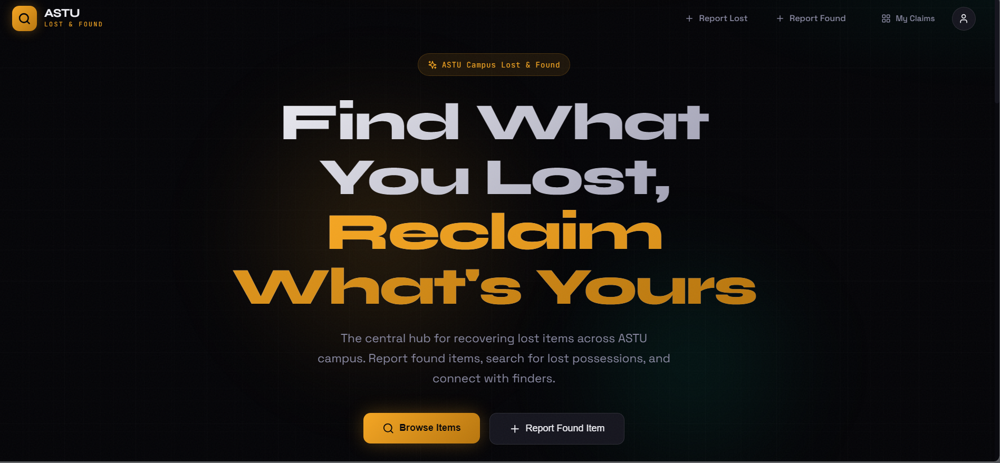
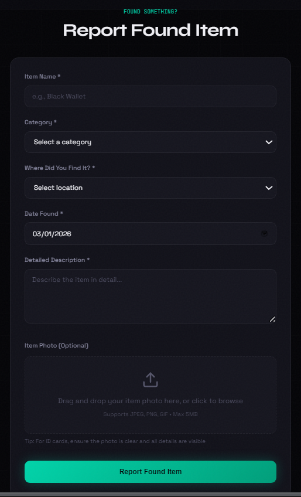
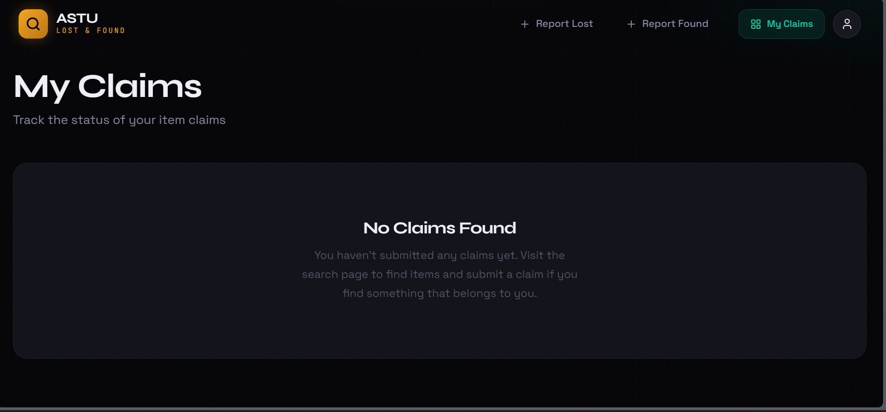
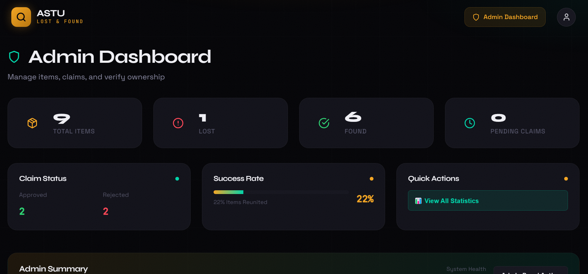
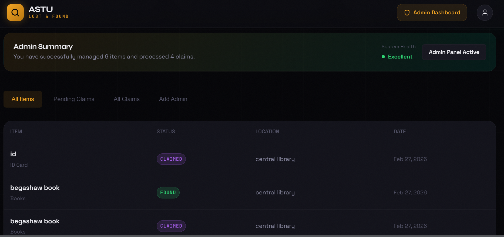

# ASTU Lost and Found System

A comprehensive web application for managing lost and found items at ASTU (Adama Science and Technology University). This system allows students, faculty, and staff to report lost items, report found items, and claim items through an intuitive interface.

## Table of Contents

- [Overview](#overview)
- [Features](#features)
- [Technologies Used](#technologies-used)
- [Project Structure](#project-structure)
- [Installation](#installation)
- [Configuration](#configuration)
- [API Endpoints](#api-endpoints)
- [Usage](#usage)
- [Contributing](#contributing)
- [License](#license)

## Overview

The ASTU Lost and Found System is a modern web application designed to streamline the process of reporting and recovering lost items within the university community. The system provides separate interfaces for regular users and administrators, ensuring efficient management of lost and found items.

## Features

### User Features
- **User Registration and Authentication**: Secure signup and login system with JWT tokens
- **Report Lost Items**: Users can report items they have lost with detailed descriptions
- **Report Found Items**: Users can report items they have found
- **Search Items**: Advanced search functionality to find lost or found items
- **Claim Items**: Users can claim found items by providing proof of ownership
- **My Claims**: Dashboard to track all claims made by the user

### Admin Features
- **Admin Dashboard**: Comprehensive dashboard for managing the system
- **Item Management**: View, approve, and manage reported items
- **Claim Management**: Review and process item claims
- **User Management**: View and manage registered users
- **System Analytics**: Overview of system statistics and activity

### System Features
- **Role-Based Access Control**: Different permissions for users and administrators
- **Data Validation**: Comprehensive validation for all user inputs
- **Responsive Design**: Mobile-friendly interface that works on all devices
- **Security**: Password hashing, JWT authentication, and rate limiting

## Technologies Used

### Backend
- **Node.js** - JavaScript runtime environment
- **Express.js** - Web application framework
- **MongoDB** - NoSQL database
- **Mongoose** - MongoDB object modeling
- **JWT** - JSON Web Token for authentication
- **bcryptjs** - Password hashing
- **Helmet** - Security middleware
- **Express Rate Limit** - Rate limiting middleware
- **CORS** - Cross-Origin Resource Sharing

### Frontend
- **React** - JavaScript library for building user interfaces
- **React Router** - Client-side routing
- **Framer Motion** - Animation library
- **Lucide React** - Icon library
- **React Hot Toast** - Toast notifications
- **Axios** - HTTP client for API requests

### Development Tools
- **Vite** - Build tool and development server
- **ESLint** - Code linting
- **Prettier** - Code formatting

## Project Structure

```
Astu_lost_found/
├── backend/                    # Backend server
│   ├── src/
│   │   ├── controllers/        # Route controllers
│   │   │   ├── adminControllers.js
│   │   │   ├── authcontroller.js
│   │   │   ├── claimController.js
│   │   │   ├── dashboardController.js
│   │   │   └── itemController.js
│   │   ├── middleware/         # Middleware functions
│   │   │   └── authMiddleware.js
│   │   ├── models/            # Database models
│   │   │   ├── Claim.js
│   │   │   ├── Item.js
│   │   │   └── User.js
│   │   ├── routes/            # API routes
│   │   │   ├── adminRoutes.js
│   │   │   ├── authRoutes.js
│   │   │   ├── claimRoutes.js
│   │   │   ├── dashboardRoutes.js
│   │   │   └── itemRoutes.js
│   │   ├── server.js          # Main server file
│   │   └── utils/             # Utility functions
│   │       └── seedAdmin.js
│   ├── package.json
│   └── .env                   # Environment variables
├── frontend/                  # Frontend application
│   ├── public/
│   ├── src/
│   │   ├── components/        # Reusable components
│   │   │   ├── ItemCard.jsx
│   │   │   ├── Navbar.jsx
│   │   │   └── SearchBar.jsx
│   │   ├── context/           # React context
│   │   │   ├── AuthContext.jsx
│   │   │   └── ItemContext.jsx
│   │   ├── pages/             # Application pages
│   │   │   ├── AdminDashboard.jsx
│   │   │   ├── ClaimItem.jsx
│   │   │   ├── Home.jsx
│   │   │   ├── Login.jsx
│   │   │   ├── MyClaims.jsx
│   │   │   ├── Register.jsx
│   │   │   ├── ReportFound.jsx
│   │   │   ├── ReportLost.jsx
│   │   │   └── SearchItems.jsx
│   │   ├── App.jsx            # Main App component
│   │   ├── App.css            # Global styles
│   │   ├── index.css          # CSS reset and base styles
│   │   ├── main.jsx           # Application entry point
│   │   └── services/          # API service functions
│   ├── package.json
│   └── vite.config.js         # Vite configuration
├── README.md                  # This file
└── .gitignore                 # Git ignore file
```

## Demo Screenshots

Experience the ASTU Lost and Found System through these screenshots showcasing the application's key features and beautiful design:

### User Interface Showcase

<div align="center">
  <div style="display: grid; grid-template-columns: repeat(3, 1fr); gap: 20px; max-width: 1200px;">
    <div>
      
      <p align="center" style="font-size: 0.9rem; color: #8888a0; margin-top: 8px;">Landing Page - Hero Section</p>
    </div>
    <div>
      
      <p align="center" style="font-size: 0.9rem; color: #8888a0; margin-top: 8px;">How It Works - Process Overview</p>
    </div>
    <div>
      
      <p align="center" style="font-size: 0.9rem; color: #8888a0; margin-top: 8px;">Get Started - Call to Action</p>
    </div>
  </div>
  
  <div style="display: grid; grid-template-columns: repeat(3, 1fr); gap: 20px; max-width: 1200px; margin-top: 20px;">
    <div>
      
      <p align="center" style="font-size: 0.9rem; color: #8888a0; margin-top: 8px;">Items to Claim - Recently Found</p>
    </div>
    <div>
      
      <p align="center" style="font-size: 0.9rem; color: #8888a0; margin-top: 8px;">Report Found Item - Submission Form</p>
    </div>
    <div>
      
      <p align="center" style="font-size: 0.9rem; color: #8888a0; margin-top: 8px;">My Claims - User Dashboard</p>
    </div>
  </div>
  
  <div style="display: grid; grid-template-columns: repeat(3, 1fr); gap: 20px; max-width: 1200px; margin-top: 20px;">
    <div>
      
      <p align="center" style="font-size: 0.9rem; color: #8888a0; margin-top: 8px;">Admin Dashboard - Overview</p>
    </div>
    <div>
      
      <p align="center" style="font-size: 0.9rem; color: #8888a0; margin-top: 8px;">Admin Summary - Statistics</p>
    </div>
    <div>
      
      <p align="center" style="font-size: 0.9rem; color: #8888a0; margin-top: 8px;">Mobile Responsive - Cross-Device</p>
    </div>
  </div>
</div>

### Design Features Highlighted

- **Modern Dark Theme**: Elegant dark color scheme with gold and teal accents
- **Responsive Design**: Fully responsive layout that works on desktop, tablet, and mobile devices
- **Interactive Elements**: Smooth animations and hover effects using Framer Motion
- **User-Friendly Interface**: Intuitive navigation and clear visual hierarchy
- **Professional Typography**: Carefully selected fonts for optimal readability
- **Status Indicators**: Clear visual feedback for item status and claim progress

### Technical Implementation

The application features a sophisticated frontend built with React, utilizing modern CSS-in-JS styling with CSS variables for consistent theming. The design incorporates subtle animations, gradient effects, and a carefully crafted color palette that enhances user experience while maintaining accessibility standards.

## Installation

### Prerequisites

- Node.js (version 14 or higher)
- MongoDB (local installation or MongoDB Atlas)
- npm or yarn

### Backend Setup

1. Clone the repository:
```bash
git clone https://github.com/Respectus11/Astu_lost_found.git
cd Astu_lost_found/backend
```

2. Install dependencies:
```bash
npm install
```

3. Set up environment variables:
Create a `.env` file in the backend directory with the following variables:
```env
PORT=5000
MONGO_URI=mongodb://localhost:27017/astu_lost_found
JWT_SECRET=your_jwt_secret_key_here
FRONTEND_URL=http://localhost:5174
```

4. Start the backend server:
```bash
npm start
```

### Frontend Setup

1. Navigate to the frontend directory:
```bash
cd ../frontend
```

2. Install dependencies:
```bash
npm install
```

3. Start the development server:
```bash
npm run dev
```

The application will be available at `http://localhost:5174` (or the port specified in your Vite configuration).

## Configuration

### Environment Variables

#### Backend (.env)
- `PORT`: Server port (default: 5000)
- `MONGO_URI`: MongoDB connection string
- `JWT_SECRET`: Secret key for JWT tokens
- `FRONTEND_URL`: Frontend application URL for CORS

#### Frontend
No environment variables required for the frontend.

### Database Configuration

The application uses MongoDB as the database. You can use either:
- Local MongoDB installation
- MongoDB Atlas (cloud service)

For MongoDB Atlas, update the `MONGO_URI` in your `.env` file with your Atlas connection string.

## API Endpoints

### Authentication
- `POST /api/auth/register` - User registration
- `POST /api/auth/login` - User login
- `GET /api/auth/profile` - Get user profile (protected)

### Items
- `GET /api/items` - Get all items
- `GET /api/items/:id` - Get item by ID
- `POST /api/items` - Create new item (protected)
- `PUT /api/items/:id` - Update item (protected)
- `DELETE /api/items/:id` - Delete item (protected)
- `GET /api/items/search` - Search items

### Claims
- `GET /api/claims` - Get all claims
- `GET /api/claims/:id` - Get claim by ID
- `POST /api/claims` - Create new claim (protected)
- `PUT /api/claims/:id` - Update claim status (admin only)
- `DELETE /api/claims/:id` - Delete claim (protected)

### Admin
- `GET /api/admin/users` - Get all users (admin only)
- `GET /api/admin/items` - Get all items (admin only)
- `GET /api/admin/claims` - Get all claims (admin only)
- `PUT /api/admin/items/:id/approve` - Approve item (admin only)
- `DELETE /api/admin/items/:id` - Delete item (admin only)

### Dashboard
- `GET /api/dashboard/stats` - Get system statistics (admin only)
- `GET /api/dashboard/recent` - Get recent activity (admin only)

## Usage

### For Users

1. **Registration**: Visit the registration page to create an account
2. **Login**: Use your credentials to log in
3. **Report Lost Item**: Use the "Report Lost" form to report missing items
4. **Report Found Item**: Use the "Report Found" form to report found items
5. **Search Items**: Use the search functionality to find items
6. **Claim Items**: Submit claims for found items you believe belong to you
7. **Track Claims**: View the status of your claims in "My Claims"

### For Administrators

1. **Login**: Use admin credentials to access the admin dashboard
2. **Manage Items**: Review and approve reported items
3. **Process Claims**: Review and process item claims
4. **User Management**: View and manage registered users
5. **System Analytics**: Monitor system activity and statistics

## Contributing

I welcome contributions to improve the ASTU Lost and Found System. To contribute:

1. Fork the repository
2. Create a feature branch (`git checkout -b feature/amazing-feature`)
3. Commit your changes (`git commit -m 'Add amazing feature'`)
4. Push to the branch (`git push origin feature/amazing-feature`)
5. Open a Pull Request

Please ensure your code follows the existing code style and includes appropriate tests.

## Support

For support and questions:
- Create an issue in the GitHub repository

## Acknowledgments

- Adama Science and Technology University for the opportunity
- The open-source community for the amazing tools and libraries used in this project